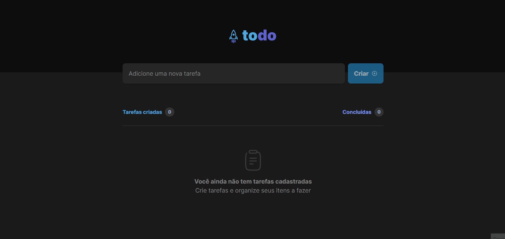

Projeto criado para ajudar meu aprendizado com os principais conceitos do ReactJS, Estado e imutabilidade. Este projeto é feito para verificar suas tarefas do dia.

[Clique aqui para abrir o site de visualização](https://todo-list-beige-ten.vercel.app/)

## 🚀 Tecnologias

Esse projeto foi desenvolvido com as seguintes tecnologias:

- ReactJS
- TypeScript
- TailwindCSS
- [Node e NPM](https://nodejs.org/)
- [Vite](https://vitejs.dev/)

## 📃 Lista de Tarefas

- [X]  **Adicionar uma nova tarefa**
- [X]  **Marcar e desmarcar uma tarefa como concluída**
- [X]  **Remover uma tarefa da listagem**
- [X]  **Mostrar o progresso de conclusão das tarefas**
